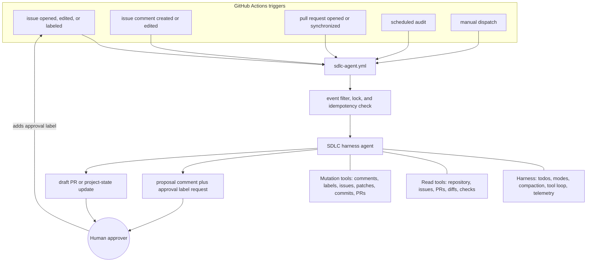

# Agentic SDLC Workflow — Harness-Based Plan

Status: **Draft for review**

Last revised: **2026-07-27**

## 1. Purpose

This document defines the issue, specification, implementation, review, and
release workflow for Shadow Circuit. A single Microsoft Agent Framework harness
agent assists with planning and execution while GitHub provides the durable
control plane.

The agent may analyze, propose, label, comment, create approved issues, and open
approved draft pull requests. The human remains the sole design authority,
reviewer, merger, and release approver.

The harness supplies model/tool loops, todo tracking, context compaction,
session state, approval primitives, and telemetry. The repository must still
provide:

- SDLC instructions and domain knowledge.
- Safe, narrowly scoped tools.
- Durable project state.
- An asynchronous human-approval protocol.
- Idempotency, concurrency control, and audit records.
- GitHub authentication and least-privilege permissions.

## 2. Design principles

1. **GitHub is the durable control plane.** Specifications, issue state,
   approval labels, comments, commits, and pull requests survive individual
   workflow runs.
2. **The harness is an execution runtime, not a project database.** Harness
   session history and file memory must never be the only record of a decision.
3. **Proposals and execution are separate runs.** A run proposes a mutation; a
   human approval label authorizes a later run to perform it.
4. **No implicit authority.** An issue, comment, source file, or model response
   cannot grant the agent additional permissions.
5. **Every mutation is idempotent.** Retried or duplicate events must not create
   duplicate comments, issues, branches, commits, or pull requests.
6. **Specifications define outcomes; the tech-stack reference constrains
   implementation.**
7. **The agent never merges or pushes directly to `main`.**
8. **Small work stays small.** Epic and Feature layers are used only when they
   improve coordination.

## 3. Authority and document precedence

When sources disagree, use this order:

1. Approved specification and its acceptance criteria.
2. `docs/plans/agent-tech-stack.md` implementation constraints.
3. Executable repository configuration and current source code.
4. `docs/plans/concept.md` product and design intent.
5. `docs/plans/tech-stack.md` architectural rationale.
6. Agent memory and previous model output.

If levels 2 and 3 disagree, the agent reports documentation drift and stops the
affected work. It must not silently choose one.

## 4. Architecture



The harness's interactive tool-approval requests are useful in local sessions.
An unattended GitHub Actions job cannot wait indefinitely for an interactive
response. In Actions, approval is represented by explicit GitHub labels and
consumed by a new workflow run.

## 5. Roles and boundaries

| Role | Filled by | Responsibilities |
|---|---|---|
| Game Designer | AI proposes; human decides | Mechanics, patterns, layouts, tuning questions |
| Programmer | AI | TypeScript/Phaser changes within an approved Task |
| Pixel Artist | AI for placeholders/specifications | Placeholder textures and asset requirements |
| Audio/Composer | AI for specifications | Track lists, SFX cues, and integration requirements |
| QA/Playtester | AI plus human | Automated checks and manual playtest checklists |
| Producer/PM | AI proposes; human controls priority | Backlog hygiene, dependencies, milestones |
| Approver | Human | Specifications, plans, implementation authorization, merge, release |

The agent may make routine engineering decisions that are already constrained by
an approved spec and the tech-stack reference. It must ask before making a new
product decision, changing acceptance criteria, adding scope, or choosing among
materially different designs.

## 6. Work hierarchy

The default hierarchy is:

```text
Spec → Task → Pull Request
```

For larger work:

```text
Spec → Epic → Feature → Task → Pull Request
```

Use an Epic only when work spans multiple independently valuable Features. Use a
Feature only when it requires multiple independently reviewable Tasks. Each
Task corresponds to at most one implementation pull request.

### 6.1 Type labels

- `type:spec`
- `type:epic`
- `type:feature`
- `type:task`
- `type:bug`
- `type:chore`
- `type:research`

### 6.2 Area labels

- `area:player`
- `area:enemy`
- `area:boss`
- `area:stage`
- `area:systems`
- `area:ui`
- `area:build`
- `area:ci`
- `area:agent`

### 6.3 Discipline labels

- `discipline:code`
- `discipline:art`
- `discipline:audio`
- `discipline:design`
- `discipline:qa`

### 6.4 Severity labels

- `severity:critical` — crash, broken build, data loss, or unplayable game.
- `severity:major` — materially incorrect behavior or blocked gameplay.
- `severity:minor` — cosmetic issue, isolated edge case, or polish.

### 6.5 Status labels

- `status:proposed`
- `status:triaged`
- `status:ready`
- `status:in-progress`
- `status:in-review`
- `status:playtest`
- `status:done`
- `status:blocked`

Only one primary `status:*` label may be present at a time.

### 6.6 Approval labels

- `approve:plan`
- `approve:create-issues`
- `approve:implement`
- `approve:revise`
- `approve:close`

Approval labels are single-use capabilities. The workflow removes the label
after recording and consuming it. Approval is valid only for the proposal
identifier included in the agent's comment; a changed proposal requires new
approval.

### 6.7 Provenance label

- `agent:generated`

The mutation tool applies `agent:generated` only when the agent creates the
issue or pull request. Human-facing issue templates must not include this label
by default. Machine-readable operation markers remain the authoritative
idempotency record.

## 7. Specification-driven development

Specifications live in `docs/specs/`. Each specification covers one coherent
outcome and uses this minimum format:

```markdown
# Spec: [Title]

Status: Draft | Approved | In Progress | Done
Owner: [human owner]
Last updated: YYYY-MM-DD

## Summary
[What this is and why it matters.]

## Acceptance Criteria
- [ ] Observable criterion

## Design Notes
[Mechanics, patterns, layout, tuning, and constraints.]

## Dependencies
[Required prior work.]

## Risks and Open Questions
[Unknowns and decisions still required.]

## Verification
[Automated checks and manual playtest evidence.]
```

### 7.1 Specification lifecycle

1. A human writes or revises a specification.
2. A `type:spec` issue links to the exact specification path.
3. The agent reviews consistency, dependencies, testability, and open questions.
4. The agent posts questions or a proposed plan with a stable proposal ID.
5. The human answers through an issue comment.
6. The `issue_comment` trigger reruns the reviewer.
7. The human adds `approve:plan`.
8. The agent records the approved plan.
9. The agent proposes Task issues and, for large work, optional Epic/Feature
   issues.
10. The human adds `approve:create-issues`.
11. The agent creates missing issues idempotently and links them to their
    parents.
12. Each Task is authorized independently with `approve:implement`.

The agent must never interpret silence as approval.

## 8. Bug workflow

1. A human opens a `type:bug` issue describing reproduction steps, expected
   behavior, actual behavior, affected scene/system, and available errors.
2. The agent checks for duplicates, assigns area and severity, reads relevant
   code, and posts its evidence.
3. The agent proposes a bounded fix plan and verification checklist.
4. The human adds `approve:implement`.
5. The agent creates or reuses a deterministic branch and implements the fix.
6. The agent runs all required checks and opens or updates one draft PR.
7. Runtime behavior receives a human playtest checklist.
8. The human reviews and merges.

Critical bugs take priority over feature work, but they still require explicit
implementation approval unless emergency policy is separately documented.

## 9. Agent tools

### 9.1 Read-only tools

| Tool | Purpose |
|---|---|
| `read_repo_file(path)` | Read a UTF-8 file from the checked-out repository |
| `search_issues(query)` | Search issues and existing proposal markers |
| `get_issue(number)` | Read an issue and comments |
| `get_pull_request(number)` | Read PR metadata, changed files, and patches |
| `get_check_runs(ref)` | Read CI check status and URLs |
| `get_review_comments(number)` | Read actionable review feedback |

### 9.2 Mutation tools

| Tool | Required authorization |
|---|---|
| `comment_on_issue(number, body, marker)` | Allowed for managed issues; dry-run aware |
| `replace_status_label(number, status)` | Allowed except `status:done`; dry-run aware |
| `add_taxonomy_labels(number, labels)` | Allowed for managed issues; dry-run aware |
| `record_plan_approval(proposal_id)` | `approve:plan` |
| `create_issue(..., proposal_id, item_id)` | `approve:create-issues` |
| `update_issue(...)` | Matching approval when scope/state changes materially |
| `create_branch(name, proposal_id, base_sha)` | `approve:implement` |
| `upsert_repo_file(..., expected_sha)` | `approve:implement` or `approve:revise` |
| `create_or_update_draft_pr(...)` | `approve:implement` |

After a successful protected operation, the runner consumes the triggering
approval label and records an audit comment. It does not consume an approval
when the required operation fails.

All path-taking tools reject absolute paths, traversal, symlink escape, and
modification outside an allowlist. Changes to these paths require a separate
human-authored PR and are denied to the agent by default:

- `.github/workflows/`
- `.github/CODEOWNERS`
- `AGENTS.md` and `.github/instructions/`
- `agents/sdlc_agent/instructions.py`
- Agent authentication or permission configuration
- Dependency manifests and lockfiles

### 9.3 Local validation tools

- `run_npm_ci()`
- `run_typecheck()`
- `run_build()`
- `run_lint()` once defined
- `run_tests()` once defined

Command tools use a fixed command allowlist; the model cannot supply arbitrary
shell text.

## 10. Idempotency and concurrency

Every generated object contains a machine-readable marker:

```text
<!-- sdlc-agent:{operation}:{subject}:{proposal-id} -->
```

Before any mutation, the tool searches for its marker and returns the existing
resource when found. Branch names are deterministic:

```text
agent/task-{issue-number}-{slug}
```

The workflow uses a concurrency group keyed by issue or PR number:

```yaml
concurrency:
  group: sdlc-agent-${{ github.event.issue.number || github.event.pull_request.number || github.run_id }}
  cancel-in-progress: false
```

Tools use expected SHA/version checks so parallel changes fail safely instead of
overwriting newer work.

## 11. Dry-run behavior

`DRY_RUN=true` is enforced inside every mutation tool, not only in the prompt.
In dry-run mode, mutation tools return the proposed request without calling
GitHub or writing files. The final report lists:

- Proposed mutations.
- Required approval labels.
- Files that would change.
- Validation commands that would run.
- Estimated model/tool-call budget.

## 12. Harness configuration

The DeepSeek endpoint implements OpenAI-compatible Chat Completions. Therefore
the agent uses `OpenAIChatCompletionClient`, not the Responses-oriented
`OpenAIChatClient`.

```python
import os

from agent_framework import create_harness_agent, todos_remaining
from agent_framework.openai import OpenAIChatCompletionClient

client = OpenAIChatCompletionClient(
    model=os.environ.get("DEEPSEEK_MODEL", "deepseek-v4-pro"),
    base_url="https://api.deepseek.com",
    api_key=os.environ["DEEPSEEK_API_KEY"],
)

agent = create_harness_agent(
    client=client,
    name="sdlc-agent",
    agent_instructions=SDLC_AGENT_INSTRUCTIONS,
    tools=TOOLS,
    max_context_window_tokens=128_000,
    max_output_tokens=16_384,
    loop_should_continue=todos_remaining(),
    loop_max_iterations=10,
)
```

Before implementation, a compatibility test must verify:

- Harness imports against the pinned dependency versions.
- Chat Completions tool calling through DeepSeek.
- Thinking/reasoning parameters supported by the selected client.
- Todo looping and maximum-iteration behavior.
- Approval-request behavior in local interactive mode.
- Compaction and telemetry output.

Looping has a strict iteration cap. A single run may not create more than the
configured number of issues, comments, commits, or model calls.

## 13. Durable state and memory

The durable record consists of:

- Approved specifications.
- Issue bodies, comments, labels, and milestones.
- Proposal IDs and consumed approval records.
- Git commits and pull requests.
- A reviewed `docs/decisions/` log for lasting design decisions.

Harness file memory is optional scratch state. It is not committed automatically
and may be discarded between Actions runs. If cross-run conversational memory
is later required, it must use a purpose-built store with retention, access
control, and backup policy.

## 14. GitHub Actions

### 14.1 Agent workflow

```yaml
name: SDLC Agent

on:
  issues:
    types: [opened, edited, labeled]
  issue_comment:
    types: [created, edited]
  pull_request:
    types: [opened, synchronize]
  schedule:
    - cron: "0 14 * * 1-5" # 08:00 Edmonton during MDT; 07:00 during MST
  workflow_dispatch:
    inputs:
      prompt:
        description: What should the agent analyze?
        required: true
        type: string
      dry_run:
        description: Prevent all mutations
        required: true
        default: true
        type: boolean

permissions:
  contents: read

concurrency:
  group: >-
    sdlc-agent-${{
      github.event.issue.number ||
      github.event.pull_request.number ||
      github.run_id
    }}
  cancel-in-progress: false

jobs:
  run:
    if: >-
      ${{
        vars.SDLC_AGENT_ENABLED == 'true' &&
        (
          github.event_name != 'pull_request' ||
          github.event.pull_request.head.repo.full_name == github.repository
        )
      }}
    runs-on: ubuntu-latest
    timeout-minutes: 30
    permissions:
      contents: write
      issues: write
      pull-requests: write
      checks: read
    steps:
      - uses: actions/checkout@v4
        with:
          fetch-depth: 0
      - uses: actions/setup-python@v5
        with:
          python-version: "3.12"
          cache: pip
          cache-dependency-path: agents/requirements.txt
      - run: python -m pip install --requirement agents/requirements.txt
      - run: python -m sdlc_agent.run
        env:
          PYTHONPATH: agents
          DEEPSEEK_API_KEY: ${{ secrets.DEEPSEEK_API_KEY }}
          DEEPSEEK_MODEL: ${{ vars.DEEPSEEK_MODEL || 'deepseek-v4-pro' }}
          GITHUB_TOKEN: ${{ secrets.GITHUB_TOKEN }}
          TRIGGER_EVENT: ${{ github.event_name }}
          GITHUB_EVENT_ACTION: ${{ github.event.action || '' }}
          GITHUB_EVENT_LABEL_NAME: ${{ github.event.label.name || '' }}
          ISSUE_NUMBER: ${{ github.event.issue.number || '' }}
          PR_NUMBER: ${{ github.event.pull_request.number || '' }}
          MANUAL_PROMPT: ${{ inputs.prompt || '' }}
          DRY_RUN: >-
            ${{
              github.event_name == 'workflow_dispatch' &&
              inputs.dry_run ||
              false
            }}
          SDLC_AGENT_ENABLED: ${{ vars.SDLC_AGENT_ENABLED || 'false' }}
```

The implementation must filter `issue_comment` events to managed issues and
ignore comments carrying the agent's own marker.

GitHub generally suppresses new workflow runs caused by `GITHUB_TOKEN`. The
implementation must not depend on an agent-created issue, label, commit, or PR
automatically triggering the next phase. Use one of:

1. An explicit `repository_dispatch` after a completed mutation.
2. A deliberately scoped GitHub App installation token.
3. A bounded continuation within the same run.

The chosen mechanism must be documented and tested before live mutation is
enabled. A fine-grained PAT is not the default.

### 14.2 CI workflow

```yaml
name: CI

on:
  push:
  pull_request:

permissions:
  contents: read

concurrency:
  group: ci-${{ github.workflow }}-${{ github.ref }}
  cancel-in-progress: true

jobs:
  check:
    runs-on: ubuntu-latest
    timeout-minutes: 15
    steps:
      - uses: actions/checkout@v4
      - uses: actions/setup-node@v4
        with:
          node-version: "22"
          cache: npm
      - run: npm ci
      - run: npm run typecheck
      - run: npm run build
```

Add lint and tests to CI as soon as their scripts exist.

## 15. Trigger behavior

| Trigger | Behavior |
|---|---|
| New `type:spec` issue | Review spec and post questions or a plan proposal |
| New `type:bug` issue | Triage, investigate, and propose a fix |
| New untyped issue | Propose taxonomy; apply safe labels when policy permits |
| Issue edited | Re-evaluate only when the content hash changed |
| Human issue comment | Re-evaluate managed questions and proposals |
| `approve:plan` | Record the referenced plan as approved |
| `approve:create-issues` | Create the referenced issue set idempotently |
| `approve:implement` | Implement the referenced Task on a deterministic branch |
| PR opened | Verify single-Task scope and post a Definition-of-Done checklist |
| PR synchronized | Re-read the diff and current checks; update the existing review comment |
| Schedule | Produce one backlog audit; do not mutate without approval |
| Manual dispatch | Perform requested analysis; dry-run defaults to true |

## 16. Definition of Done

A Task is Done only when:

- The change matches one approved Task and its parent specification.
- Acceptance criteria are mapped to evidence.
- `npm ci`, typecheck, and build pass.
- Relevant tests pass once tests exist.
- No unexpected dependency, generated-file, workflow, or instruction changes
  are present.
- Runtime behavior has a completed manual playtest checklist when automation is
  insufficient.
- CI passes on the final commit.
- The human approves and merges the PR.
- Durable issue/spec status is updated without relying on agent memory.

## 17. Security and governance

- Treat issue bodies, comments, PR text, source comments, and linked content as
  untrusted input.
- Never place secrets, full prompts, hidden reasoning, or credentials in logs,
  memory files, comments, or telemetry.
- Validate all tool arguments independently of model output.
- Use minimal GitHub permissions and an environment approval gate before
  enabling repository writes.
- Deny self-modification of workflows, instructions, permissions, and approval
  policy.
- Record trigger actor, source SHA, model, dependency version, proposal ID,
  approval actor, requested mutation, result, and token usage.
- Provide a repository variable such as `SDLC_AGENT_ENABLED=false` as a kill
  switch checked before any model or mutation call.

## 18. Rollout

1. **Compatibility spike:** pinned dependencies, DeepSeek tool calling, harness
   loop, and import smoke tests.
2. **CI baseline:** typecheck and build.
3. **Templates and taxonomy:** specification, task, and bug templates plus
   labels.
4. **Read-only tools:** repository, issue, PR diff, review, and checks.
5. **Dry-run agent:** manual dispatch only.
6. **Live analysis:** comments and safe taxonomy labels with idempotency.
7. **Asynchronous approval:** proposal IDs, approval labels, and consumption
   records.
8. **Issue creation:** approved, bounded, and idempotent.
9. **Restricted implementation:** patch, validate, commit, and draft PR for one
   known-defect Task.
10. **PR synchronization:** diff and CI-aware review updates.
11. **Scheduled audits:** report-only backlog and documentation-drift checks.
12. **Release assistance:** approved release notes after the earlier phases are
    proven.

The recommended first implementation specification groups the known defects
into three Tasks: damage/hit detection, scene-state transitions, and input/UI
consistency.

## 19. Open decisions

1. Select `repository_dispatch`, a GitHub App, or bounded same-run continuation
   for intentional workflow chaining.
2. Decide whether local interactive harness sessions are in scope in addition
   to GitHub Actions.
3. Set per-run limits for tokens, model calls, comments, issues, commits, and
   estimated cost.
4. Choose the initial test framework and browser/runtime smoke-test strategy.
5. Confirm the local time desired for scheduled audits; GitHub cron is UTC and
   does not adjust for Edmonton daylight-saving changes.

## 20. References

- [Microsoft Agent Framework harness release](https://devblogs.microsoft.com/agent-framework/the-microsoft-agent-framework-harness-is-now-released/)
- [Microsoft Agent Framework harness documentation](https://learn.microsoft.com/en-us/agent-framework/agents/harness)
- [DeepSeek API quick start](https://api-docs.deepseek.com/)
- [GitHub `GITHUB_TOKEN` behavior](https://docs.github.com/en/actions/concepts/security/github_token)
- [GitHub Actions token permissions](https://docs.github.com/en/actions/tutorials/authenticate-with-github_token)
