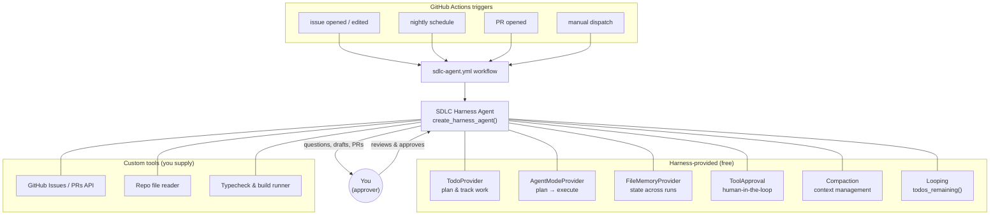
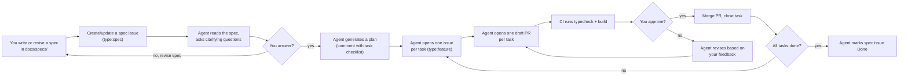

# Agentic SDLC Workflow — Harness-Based Plan

Status: **Draft for review**.

## 1. What changed from the previous plan

The [Microsoft Agent Framework Harness](https://devblogs.microsoft.com/agent-framework/the-microsoft-agent-framework-harness-is-now-released/) (released July 2026) bundles the entire agent runtime into a single call. The earlier plan defined 7 separate agents each requiring custom tool loops, memory, and approval wiring. The harness provides all of that for free: **todo-based planning, persistent file memory, tool-calling loops, context compaction, tool approval, and OpenTelemetry** — from `create_harness_agent()`.

This plan replaces 7 custom agents with **one harness agent** that has SDLC-specific tools and instructions. The harness handles "how to be an agent"; you supply "what to do."

## 2. Architecture



**One `create_harness_agent()` call** configures everything. The same agent handles triage, backlog curation, planning, PR review, QA checklists, and release notes — because the harness gives it a todo list, memory, and the ability to work through multi-step plans autonomously. You are the approver on all pull requests.

## 3. Key decisions

| Decision | Choice | Rationale |
|---|---|---|
| Agent framework | `agent-framework` (Python) harness via `create_harness_agent` | Single API call gives planning, memory, approvals, tool loops, telemetry — no custom agent runtime to build |
| Chat client | `OpenAIChatClient` pointed at DeepSeek API (`api.deepseek.com`) | DeepSeek's API is OpenAI-compatible; reuses the same key already configured in the devcontainer's Copilot Chat extension |
| Language | Python 3.12+ | Agent Framework's Python SDK is the primary SDK; keeps automation separate from the TypeScript game code |
| Execution | GitHub Actions (event + schedule triggers) | No infrastructure to host; auditable; matches "GitHub Issues-based workflow" requirement |
| Autonomy | Agent plans, questions, labels, comments, opens draft PRs — you approve everything; agent never merges | One PR per task; user is the sole gatekeeper on all pull requests |
| Persistence | Harness `FileMemoryProvider` writing to `.github/agent-memory/` | Survives between workflow runs; committed to the repo so state is version-controlled and reviewable |
| Model | `deepseek-v4-flash` for triage; `deepseek-v4-pro` for planning (with `reasoning_effort: "high"`) | Switchable via `DEEPSEEK_MODEL` env var; V4 Pro defaults to thinking mode enabled |

## 4. Development team roles

AI fills all roles. The `discipline:` label on each issue determines which hat the agent wears when working on it. You (the human) are the sole reviewer and approver for every pull request.

| Role | Filled by | Responsibilities |
|---|---|---|
| **Game Designer** | AI | Read `docs/plans/concept.md` and `docs/specs/`; propose mechanics, boss patterns, level layouts, tuning values; question you when specs are ambiguous |
| **Programmer** | AI | Implement TypeScript/Phaser code; run typecheck + build; open one PR per task |
| **Pixel Artist** | AI | Generate placeholder sprites/tilesets via `BootScene` textures; spec out asset requirements for future art; coordinate palette/sprite-sheet conventions |
| **Audio/Composer** | AI | Spec out chiptune track lists and SFX cues per stage/boss; placeholder silence until real audio assets exist |
| **QA/Playtester** | AI | Generate playtest checklists from acceptance criteria; verify typecheck + build pass; flag risky patterns |
| **Producer/PM** | AI | Groom the backlog; assign labels, milestones, and priorities; detect duplicates and stale issues; manage the status lifecycle |
| **Approver** | **You (human)** | Review every PR; merge only when satisfied; report bugs; answer the agent's questions; write and revise specs |

When the agent encounters ambiguity in a spec or an issue, it **must ask you** via an issue comment rather than guessing. It never makes design decisions without your input.

## 5. Spec-driven development process

Specs are the single source of truth. Every feature, stage, boss, system, or significant change starts as a spec before any code is written.

### 5.1 Spec lifecycle



### 5.2 Spec format

Specs live in `docs/specs/` as Markdown files. Each spec covers exactly one coherent piece of work (a stage, a boss, a system, a feature). Minimum sections:

```markdown
# Spec: [Title]

Status: Draft | Approved | In Progress | Done

## Summary
One paragraph describing what this is and why.

## Acceptance Criteria
- [ ] Criterion 1
- [ ] Criterion 2

## Design Notes
Mechanics, boss patterns, level layouts, tuning — whatever the agent needs to plan.

## Dependencies
What must exist before this can be built.

## Risks / Open Questions
What's uncertain, what could go wrong.
```

### 5.3 Agent's responsibilities during spec review

When a `type:spec` issue is opened or a spec file is added to `docs/specs/`:

1. Read the spec and all related design docs (`concept.md`, `tech-stack.md`, `StageCatalog.ts`).
2. Check for internal consistency (does the spec contradict the concept doc? Are dependencies tracked?).
3. Ask clarifying questions if anything is ambiguous or missing.
4. Once the spec is approved, generate a Plan.
5. Break the Plan into **Epics** (or Features if the spec is small enough to skip Epics).
6. Break each Epic into **Features**.
7. Break each Feature into **Tasks** — one implementable unit per checkbox.
8. Create GitHub Issues at each level with the appropriate `type:` label, all linked upward to their parent.
9. Do **not** open PRs until each Task is labeled `ready-for-scaffold`.

### 5.4 Existing specs in this repo

| Spec | Covers | Status |
|---|---|---|
| `docs/plans/concept.md` | Full game design: 8 stages, bosses, abilities, scoring, visual direction | Authoritative GDD |
| `docs/plans/tech-stack.md` | Engineering decisions: Phaser 4, TypeScript, Vite, Tiled, state-machine architecture | Authoritative |
| `docs/specs/` | Empty — future specs go here | Not started |

## 6. Bug reporting process

Bugs are reported by you and managed through GitHub Issues by the agent.

### 6.1 How you report a bug

1. Open a GitHub Issue with `type:bug`, linked to the parent Feature (or Epic) it affects.
2. Include: what you did, what you expected, what happened, which scene/boss/stage, any console errors.
3. The agent triages it automatically (see §9.3).

### 6.2 How the agent handles bugs

When a `type:bug` issue is opened:

1. **Triage immediately**: assign `area:` and `discipline:` labels, estimate severity, check for duplicates.
2. **Reproduce**: if the bug is in code the agent can inspect, read the relevant source files and attempt to identify the root cause. Post findings as a comment.
3. **Propose a fix plan**: a short task checklist in a comment. Ask you to confirm before opening a PR.
4. **Implement**: once confirmed, the agent opens one draft PR with the fix.
5. **Verify**: CI must pass (`typecheck` + `build`). If the bug involves runtime behavior (collision, health, scene transitions), the agent generates a playtest checklist for you to manually verify.

### 6.3 Bug severity labels

| Label | Meaning | Agent response |
|---|---|---|
| `severity:critical` | Crashes, build breaks, unplayable | Fix immediately, before any feature work |
| `severity:major` | Wrong behavior, blocks gameplay | Fix in current milestone |
| `severity:minor` | Cosmetic, edge case, polish | Fix when convenient |

The agent assigns severity based on its analysis; you can override it.

## 7. Devcontainer changes needed

The current `Dockerfile` (Node.js 22, Bookworm) has no Python. Add to the `apt-get install` line:

```dockerfile
python3 \
python3-pip \
python3-venv \
```

New `agents/requirements.txt`:

```
agent-framework
agent-framework-tools
openai
PyGithub
rich
python-dotenv
```

## 8. The SDLC harness agent

### 8.1 Entry point

`agents/sdlc_agent/run.py` — invoked by `.github/workflows/sdlc-agent.yml`:

```python
from agent_framework import create_harness_agent, todos_remaining
from agent_framework.openai import OpenAIChatClient
from agent_framework.file_memory import FileMemoryStore

from .tools import (
    create_issue, update_issue, comment_on_issue, add_labels,
    search_issues, get_issue, create_pull_request, create_branch,
    read_repo_file, run_typecheck, run_build,
)

agent = create_harness_agent(
    client=OpenAIChatClient(
        model=os.environ.get("DEEPSEEK_MODEL", "deepseek-v4-pro"),
        base_url="https://api.deepseek.com",
        api_key=os.environ["DEEPSEEK_API_KEY"],
    ),
    name="sdlc-agent",
    agent_instructions=SDL_AGENT_INSTRUCTIONS,
    tools=[
        create_issue, update_issue, comment_on_issue, add_labels,
        search_issues, get_issue, create_branch, create_pull_request,
        read_repo_file, run_typecheck, run_build,
    ],
    memory_store=FileMemoryStore("./.github/agent-memory"),
    max_context_window_tokens=128_000,
    max_output_tokens=16_384,
    loop_should_continue=todos_remaining(),
    loop_max_iterations=15,
)
```

### 8.2 System instructions

The full `SDL_AGENT_INSTRUCTIONS` string lives in `agents/sdlc_agent/instructions.py`. Its structure:

- **Identity**: You are the SDLC agent for Shadow Circuit, a Phaser 4 TypeScript martial-arts platformer. You fill every development role: designer, programmer, artist (specs), composer (specs), QA, and producer. The human is the approver — you propose, they decide.
- **Game knowledge**: 8 stages with unique bosses and ability unlocks from `src/levels/StageCatalog.ts`. Reference `docs/plans/concept.md` and `docs/plans/tech-stack.md` for design and engineering decisions. Read `docs/specs/` for per-feature specifications.
- **Spec-driven workflow**: Specs are the single source of truth. When a `type:spec` issue is opened, read the spec, ask clarifying questions, then generate a plan. Plans produce task issues. Task issues produce one PR each. Never implement without a spec or an approved plan.
- **Questioning rule**: Whenever a spec, issue, or bug report is ambiguous or missing information needed to proceed, **ask the human** in a comment. Do not guess design decisions, mechanics, tuning values, or acceptance criteria.
- **SDLC phases**: Design → Backlog → Planning → Implementation → Build → QA/Playtest → Release → Postmortem.
- **Issue taxonomy**: `type:feature|bug|spec|chore|research`, `area:player|enemy|boss|stage|systems|ui|build|ci`, `discipline:code|art|audio|design|qa`, `severity:critical|major|minor` (bugs only).
- **Milestones**: `v0.1 Vertical Slice`, `v0.2 Content Pipeline`, `v0.3 Districts 2-4`, `v0.4 Districts 5-7`, `v1.0 Shadow Citadel & Release`.
- **Status lifecycle**: `Proposed → Triaged → Ready → In Progress → In Review → Playtest → Done`. `Blocked` is a label overlay.
- **Definition of Done**: `npm run typecheck` passes, `npm run build` passes, lint passes (once added), acceptance criteria from the spec checked, human has approved and merged the PR.
- **PR rules**: One PR per task issue. Every PR is a draft until CI passes. Only the human merges. Always reference the parent spec and task issue in the PR body.
- **Autonomy boundary**: Never merge PRs. Never push to `main`. Never close issues the human opened without explicit approval. Always question ambiguity. Always mark agent-generated content with `agent:generated` label.
- **Trigger awareness**: Read the `TRIGGER_EVENT` environment variable to know why you were invoked (`issue_opened`, `nightly`, `pr_opened`, `manual`) and adapt your first action accordingly.

### 8.3 Tools

All tools are Python async functions registered with Agent Framework's tool decorator.

| Tool | What it does | Approval |
|---|---|---|
| `read_repo_file(path)` | Reads a file from the workspace (relative path) | Auto-approved (read-only) |
| `search_issues(query, labels, state)` | Searches GitHub Issues | Auto-approved |
| `get_issue(number)` | Gets a single issue with body + comments | Auto-approved |
| `create_issue(title, body, labels, milestone)` | Creates a new issue | Requires approval |
| `update_issue(number, body, state, milestone)` | Updates an issue's body/state/milestone | Requires approval |
| `comment_on_issue(number, body)` | Adds a comment (signed `🤖 sdlc-agent`) | Auto-approved |
| `add_labels(number, labels)` | Adds labels to an issue | Auto-approved |
| `create_branch(name)` | Creates a new branch from `main` | Requires approval |
| `create_pull_request(base, head, title, body, draft)` | Opens a draft PR | Requires approval |
| `run_typecheck()` | Runs `npm run typecheck`, returns output | Auto-approved |
| `run_build()` | Runs `npm run build`, returns output | Auto-approved |

Auto-approved tools use the harness's heuristic approval — they still log but don't block. Write operations (`create_issue`, `update_issue`, `create_branch`, `create_pull_request`) always require human approval through the harness's approval middleware.

### 8.4 How the harness maps to SDLC tasks

| SDLC task | Harness feature used |
|---|---|
| "Plan the work for Iron Crane phase 2" | `TodoProvider` creates a todo list; `AgentModeProvider` switches to plan mode |
| "Work through those todos autonomously" | `Looping` with `todos_remaining()` re-invokes until todos are complete |
| "Remember what we decided about attack hitboxes" | `FileMemoryProvider` writes durable notes to `.github/agent-memory/` |
| "Don't overflow context during a long planning session" | `Compaction` with 128K token budget |
| "Ask me before opening any issues" | `ToolApproval` blocks writes until approved |
| "How many tokens did that run cost?" | `OpenTelemetry` traces every call |

## 9. GitHub Actions workflows

### 9.1 `sdlc-agent.yml` — the one workflow

```yaml
name: SDLC Agent
on:
  issues:
    types: [opened, edited, labeled]
  pull_request:
    types: [opened, synchronize]
  schedule:
    - cron: "0 6 * * 1-5"  # weekday mornings
  workflow_dispatch:
    inputs:
      prompt:
        description: "What should the agent do?"
        required: true
      dry_run:
        description: "Preview only, don't write to GitHub"
        type: boolean
        default: false

jobs:
  run:
    runs-on: ubuntu-latest
    steps:
      - uses: actions/checkout@v4
      - uses: actions/setup-python@v5
        with:
          python-version: "3.12"
      - run: pip install -r agents/requirements.txt
      - run: python agents/sdlc_agent/run.py
        env:
          DEEPSEEK_API_KEY: ${{ secrets.DEEPSEEK_API_KEY }}
          DEEPSEEK_MODEL: ${{ vars.DEEPSEEK_MODEL || 'deepseek-chat' }}
          GITHUB_TOKEN: ${{ secrets.GITHUB_TOKEN }}
          TRIGGER_EVENT: ${{ github.event_name }}
          ISSUE_NUMBER: ${{ github.event.issue.number || '' }}
          PR_NUMBER: ${{ github.event.pull_request.number || '' }}
          DRY_RUN: ${{ inputs.dry_run || 'false' }}
```

### 9.2 `ci.yml` — prerequisite gates

```yaml
name: CI
on: [push, pull_request]
jobs:
  check:
    runs-on: ubuntu-latest
    steps:
      - uses: actions/checkout@v4
      - uses: actions/setup-node@v4
        with:
          node-version: "22"
      - run: npm ci
      - run: npm run typecheck
      - run: npm run build
```

### 9.3 Trigger-to-behavior mapping

| Trigger | Agent's first action |
|---|---|
| `issues.opened` with `type:spec` | Spec review: read the spec, check consistency, ask clarifying questions. Once approved, generate a Plan broken into Epics → Features → Tasks. |
| `issues.opened` with `type:bug` | Bug triage: verify linked Feature/Epic, assign `severity:`, attempt root-cause analysis, propose fix plan, ask for confirmation. |
| `issues.opened` with `type:epic` | Epic triage: verify parent Spec, assign `area:` label, prepare to break into Features. |
| `issues.opened` with `type:feature` | Feature triage: verify parent Epic/Spec, assign `area:` and `discipline:` labels, prepare to break into Tasks. |
| `issues.opened` with `type:task` | Task triage: verify parent Feature, confirm file list and acceptance criteria. This is the level where PRs happen. |
| `issues.opened` (untyped) | Triage: assign `type:`, `area:`, `discipline:` labels, check for duplicates, ask the human if unclassifiable. |
| `issues.edited` | Re-triage if body changed substantially. |
| `issues.labeled` with `ready-for-planning` | Plan mode: read the issue + linked parents + design docs, create a todo list, post breakdown as a comment at the appropriate level. |
| `issues.labeled` with `ready-for-scaffold` (on a Task) | Create a branch, open one draft PR with file stubs matching repo conventions, link to the Task and all parent issues. |
| `pull_request.opened` | PR readiness: review diff, check CI status, comment a structured Definition-of-Done checklist. Verify the PR references a single Task. |
| `nightly schedule` | Backlog curation: check for stale issues, un-tracked stages, duplicate detection, spec-to-task coverage gaps. |
| `workflow_dispatch` | Whatever the `prompt` input says — full interactive agent session. |

## 10. Repository layout after implementation

```text
.github/
├── workflows/
│   ├── sdlc-agent.yml          # the one harness agent workflow
│   └── ci.yml                  # typecheck + build gate
├── agent-memory/               # FileMemoryProvider writes here
│   ├── sessions/               # per-session notes (auto-created)
│   └── notes.md                # durable cross-session memory
├── ISSUE_TEMPLATE/
│   ├── spec.yml                # for type:spec issues
│   ├── epic.yml                # for type:epic issues
│   ├── feature.yml             # for type:feature issues
│   ├── task.yml                # for type:task issues (one PR each)
│   └── bug.yml                 # for type:bug issues (linked to feature/epic)
└── PULL_REQUEST_TEMPLATE.md

docs/
├── plans/
│   ├── concept.md              # game design document (authoritative)
│   ├── tech-stack.md           # engineering decisions (authoritative)
│   └── agentic-sdlc-workflow.md # this plan
└── specs/                      # per-feature specs (the single source of truth)
    └── .gitkeep

agents/
├── requirements.txt            # agent-framework, openai, PyGithub, rich, python-dotenv
├── sdlc_agent/
│   ├── __init__.py
│   ├── run.py                  # creates harness agent + invokes it
│   ├── instructions.py         # SDL_AGENT_INSTRUCTIONS (full system prompt)
│   ├── tools.py                # GitHub + build tool implementations
│   └── config.py               # labels, milestones, repo metadata
└── tests/
    └── test_tools.py           # unit tests for tool functions
```

## 11. How the harness simplifies the earlier plan

| Earlier plan (7 agents) | Harness plan (1 agent) |
|---|---|
| Each agent had its own tool-calling loop | Harness `FunctionInvocationMiddleware` |
| Each agent needed separate history storage | Harness `PerServiceCallHistoryPersistence` |
| Custom planning logic per agent | Harness `TodoProvider` + `AgentModeProvider` |
| Custom memory file per agent | Harness `FileMemoryProvider` (one store) |
| Custom approval per agent | Harness `ToolApprovalMiddleware` |
| No compaction — could overflow | Harness `CompactionMiddleware` with token budget |
| No telemetry | Harness OpenTelemetry |

## 12. Rollout plan

Phased so each stage is independently reviewable and toggleable.

1. **Devcontainer**: Add Python 3.12 + `agents/requirements.txt` to `Dockerfile`. *(Blocks everything else.)*
2. **CI workflow**: `.github/workflows/ci.yml` — typecheck + build gate. *(Prerequisite for "Done.")*
3. **Templates + labels**: `.github/ISSUE_TEMPLATE/` (spec, feature, bug), `.github/PULL_REQUEST_TEMPLATE.md`, labels (including `severity:*`), milestones.
4. **Spec directory**: Create `docs/specs/` with a `README.md` explaining the spec format and lifecycle.
5. **Tools first (no agent yet)**: Implement `agents/sdlc_agent/tools.py` — GitHub API + build tools. Unit test them. Verify with a `workflow_dispatch` that lists open issues.
6. **Harness agent (dry-run)**: Wire `create_harness_agent()` with instructions + tools. Run with `dry_run=true` to verify the agent produces sensible plans/comments without side effects.
7. **Live triage**: Enable `issues.opened` trigger. Agent labels, asks questions, and routes spec/bug/feature issues.
8. **Live planning**: Enable `ready-for-planning` label trigger. Agent posts task breakdowns from specs.
9. **Nightly curation**: Enable schedule trigger. Agent audits the backlog and spec-to-issue coverage.
10. **PR readiness**: Enable `pull_request.opened` trigger. Agent comments review checklist.
11. **Scaffolder + one-PR-per-task**: Enable `ready-for-scaffold` trigger. Agent creates branch + draft PR per task.
12. **Release notes**: Add tag-push trigger. Agent drafts release notes.

Each phase after step 6 is independently toggleable by commenting out its trigger in the workflow YAML.

## 13. Secrets needed

| Secret | Where | Purpose |
|---|---|---|
| `DEEPSEEK_API_KEY` | GitHub Actions secrets + devcontainer `.env` | Same key used for Copilot Chat extension and harness agent |
| `GITHUB_TOKEN` | Automatic in GitHub Actions | GitHub API (issues, PRs, comments, branches) |

## 14. Grounding in this repo

- [`docs/plans/concept.md`](concept.md) is the de facto Game Design Document: 8 stage/boss pairs, ability-unlock progression, scoring, replay modes, and an explicit recommendation to build one polished vertical slice first.
- [`docs/plans/tech-stack.md`](tech-stack.md) fixes the engineering stack (Phaser 4, TypeScript, Vite, Arcade Physics, Tiled) and the boss state-machine architecture.
- [`src/levels/StageCatalog.ts`](../../src/levels/StageCatalog.ts) enumerates all 8 stages/bosses/unlocks as data — the natural seed for auto-generated issues.
- Currently **no** `.github` directory, no CI, no lint config, no tests. The workflow's first automated task is to stand these up, since every later "Done" gate depends on them.

## 15. Open questions for you

1. **DeepSeek model per invocation**: Use `deepseek-v4-flash` (faster/cheaper, $0.14/$0.28 per 1M tokens) for triage and quick tasks, or `deepseek-v4-pro` (deeper reasoning, $0.435/$0.87 per 1M tokens, thinking mode default-on) for planning and implementation? The `DEEPSEEK_MODEL` env var makes this per-invocation switchable.
2. **Nightly schedule**: Weekday mornings (`0 6 * * 1-5`) as proposed, or a different cadence?
3. **Agent memory in repo**: Commit `.github/agent-memory/` (version-controlled durable notes) or add it to `.gitignore` (ephemeral)?
4. **GitHub auth**: Fine-grained PAT or a GitHub App? A PAT is faster to set up for a solo repo; a GitHub App scales better if collaborators join later.
5. **First spec**: Which spec should the agent process first after setup? The vertical-slice improvements from the earlier code review (contact damage, boss attacks, scene state), or a new stage/boss spec?
